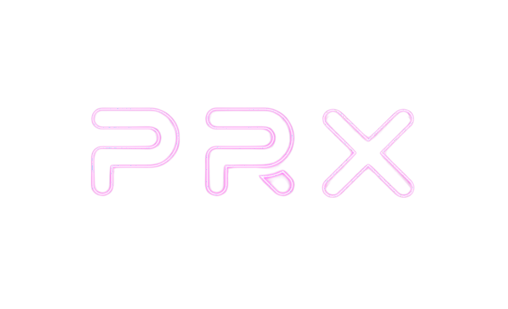
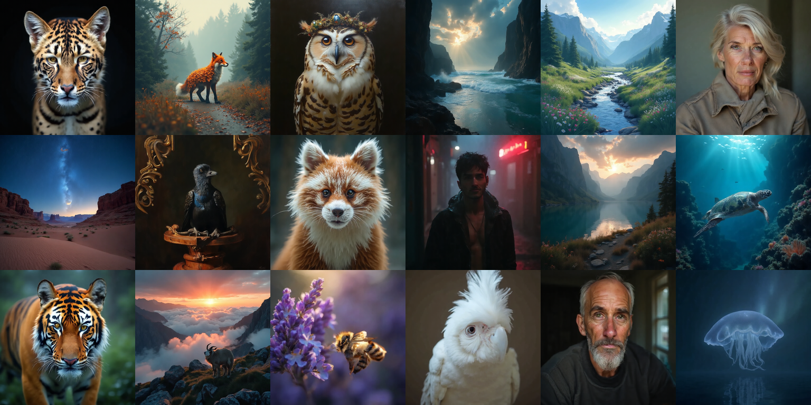

<p align="center">
  
</p>
<p align="center">
  
</p>


# PRX

Training framework for the PRX text-to-image diffusion models by [Photoroom](https://www.photoroom.com/).

Read the full story on the [Hugging Face blog](https://huggingface.co/blog/Photoroom/prx-open-source-t2i-model).

## Overview

PRX is a transformer-based latent diffusion model trained with flow matching. This repository contains everything needed to train and evaluate PRX models, including:

- A patchified transformer denoiser
- Support for multiple text encoders (T5, T5-Gemma2B, Qwen3) and VAEs (AutoencoderKL, DC-AE)
- Distributed training via [MosaicML Composer](https://github.com/mosaicml/composer) with FSDP
- Training algorithms: EMA, REPA/iREPA, SPRINT, TREAD, contrastive flow matching, Perceptual losses (P-DINO, LPIPS), etc.
- Evaluation metrics: FID, CMMD, DINO-MMD

## Pre-trained models

Pre-trained PRX models are available on Hugging Face and can be used directly with [diffusers](https://huggingface.co/Photoroom/prx-1024-t2i-beta).

## Installation

Requires Python 3.11+.

```bash
uv sync

# With optional dependencies
uv sync --extra streaming   # MosaicML Streaming dataset support
uv sync --extra lpips       # LPIPS perceptual loss
uv sync --all-extras        # Everything
```

## Training

Training is configured with [Hydra](https://hydra.cc/) YAML files. See [`configs/yamls/`](configs/yamls/) for examples. The repository includes all the training configurations used in the benchmarks presented in the [blog post](https://huggingface.co/blog/Photoroom/prx-part2).

```bash
composer -m prx.training.train --config-path=configs/yamls hydra/launcher=basic
```

## Data
We will post tomorrow a script to convert datasets into the MDS format used by PRX and exemplify how to use it to train a model on a your dataset.


## License

Apache 2.0

## Acknowledgments

PRX is built by the [Photoroom](https://www.photoroom.com/) machine learning team and large parts of this codebase were built on top of an existing private Photoroom codebase. The following previous team members made significant contributions to the foundations of this project and deserve credit, even though their work may not appear in the public git history:

- [Antoine d'Andigné](https://github.com/antoinedandi)
- [Quentin Desreumaux](https://github.com/quentindrx)
- [Benjamin Lefaudeux](https://github.com/blefaudeux)

PRX team: [David Bertoin](https://github.com/DavidBert), [Roman Frigg](https://github.com/photoroman), 
[Jon Almazán](https://github.com/almazan), 
[Eliot Andres](https://github.com/eliotandres)
